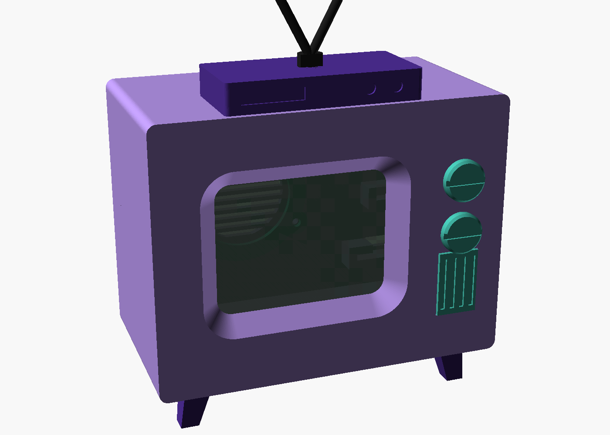
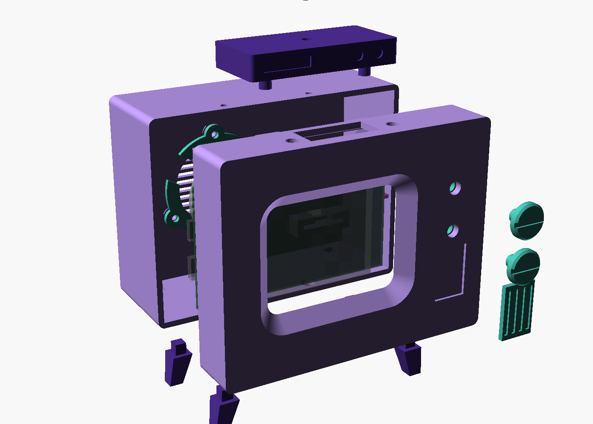

# Simpsons TV enclosure (OpenSCAD)

A cartoon-accurate television case for the CYD-Simpsons player. Parametric OpenSCAD
source, one STL per printed part, one color per part.




## Files

| File | Purpose |
|---|---|
| `simpsons_tv.scad` | The whole model. All dimensions are parameters at the top. |
| `export.sh` | Renders every part to `stl/` and refreshes `preview/`. |
| `stl/*.stl` | Print-ready parts, already in print orientation. |
| `preview/*.png` | Assembly renders. |

Render one part by hand:

```bash
/Applications/OpenSCAD-2021.01.app/Contents/MacOS/OpenSCAD -D 'part="knob"' -o stl/knob.stl simpsons_tv.scad
```

Open `simpsons_tv.scad` in OpenSCAD for the assembly view. The variables at the top
of the file control it (Window > Customizer shows them as checkboxes and sliders,
then press F5):

- `explode = 20` pulls the assembly apart.
- `show_front_shell`, `show_rear_shell`, `show_knobs`, `show_grill`, `show_legs`,
  `show_set_top_box`, `show_speaker_clamp`, `show_components` hide parts.
- `cut_x = 60` slices the model to show a section through the middle. `cut_y` and
  `cut_z` do the same on the other axes. `-1` turns a cut off.
- `part = "plate"` shows every part in print orientation.
- `export.sh` runs `check_stl.py` on every STL it writes and fails if any part is not
  a single closed shell. Run it by hand on any STL to find floating geometry: it lists
  each disconnected shell with its bounding box in print coordinates.

## Parts and colors

| STL | Qty | Color | Print orientation | Notes |
|---|---|---|---|---|
| `front_shell` | 1 | lavender, bezel painted dark purple | face down | No supports. The screen bezel is part of the shell: a 45 degree pocket from the face down to the window, painted after printing. Holds the CYD, the button carrier and the grill. The lip and screw tabs grow from a chamfered step inside the wall. |
| `rear_shell` | 1 | lavender | back panel down | No supports. Speaker vents, speaker bosses, amp and USB pockets, USB-C opening. |
| `knob` | 2 | teal or green | face down | Groove across the face is the cartoon indicator bar. |
| `knob_keeper` | 2 | any | flat | Press or glue onto the knob stem behind the front plate. |
| `button_carrier` | 1 | any | flat | Carries the two 6 x 6 mm tactile switches. |
| `grill` | 1 | teal | slots up | Decorative. Glue into the front recess. |
| `leg_l`, `leg_r` | 2 each | dark purple | on its side | Square pegs into the floor. Glue. |
| `set_top_box` | 1 | dark purple | upside down | Pegs into the roof. Not glued: it covers the microSD hatch and the two roof screws. |
| `antenna` | 1 | black | flat back down | Pegs into the top of the set-top box. |
| `speaker_clamp` | 1 | any | flat | C-ring that holds the speaker flange against the back panel. |

Cartoon colors: the body is lavender purple, the screen bezel is a very dark
purple, the legs and set-top box a deeper purple, the knobs and grill teal-green,
the antenna black. Hex values used in the preview are listed at the top of the SCAD.

The bezel is painted, not printed separately: mask along the crease where the flat
face meets the slope and paint the sloped pocket dark. The other community builds
of this TV do the same.

## Hardware

All screws are M3, driven into printed 3.0 mm pilot holes (self-tapping into PLA or PETG).
Printed holes come out undersize, so 3.0 mm in the model is what an M3 actually taps
into; the first print at 2.5 mm snapped a standoff off the plate when the screw went in.
Every standoff and boss is 7 mm across with a flared base for the same reason.

| Use | Qty | Screw |
|---|---|---|
| CYD to front shell standoffs | 4 | M3 x 6 pan head |
| Button carrier to front shell | 2 | M3 x 6 pan head |
| Rear shell to front shell tabs (roof and floor) | 4 | M3 x 6 or x 8 countersunk |
| Speaker clamp | 3 | M3 x 6 pan head |

Other parts: 2 x 6 x 6 x 5 mm through-hole tactile switches, the 40 mm speaker,
the PAM8302 amp, the USB-C breakout, wire, and a little CA glue.

## Layout

- Front 118 x 90 mm, body 65 mm deep, legs add 14 mm. Aspect ratio follows the cartoon.
- The CYD is mounted with its USB ports on the left and the microSD slot on the top
  edge, i.e. rotated 180 degrees from the usual drawing. The firmware must use display
  rotation 3 instead of 1 (and the touch map flips with it).
- The microSD card is reached through a hatch in the roof, hidden by the set-top box.
- The speaker fires rearward through vents in the back panel. The front grill is decorative.
- The USB-C breakout (22 x 17 x 2 mm, connector on the long edge) sits in a slide-in
  pocket on the back panel with its port through the panel. Wire VBUS and GND to the
  CYD's 5 V and GND pins. Power only.
- The window is positioned from the CYD, not the other way round: the board sits
  `cyd_wall_gap` from the left wall and the window centre is `cyd_screen_cx` to the
  right of the board edge. Changing the screen offset moves the window, never the board.
- The window (`win_w` x `win_h`, 57 x 43) is cut to the panel's active picture area,
  not to the 69 x 50 glass. The glass, its driver strip and the module edge all sit
  behind the bezel, so a small centring error hides a sliver of picture instead of
  showing the edge of the module. The bezel slope runs `bez_inset` per side over
  `bez_slope` deep (6 over 6, 45 degrees, the face-down print limit), then a straight
  tube continues to `bez_depth` and stops `glass_gap` above the glass. Do not close
  that gap: the touch panel is resistive and the bezel would register as a touch.
- The amp sits in a second pocket above the USB pocket. Its own holes are only 2 mm,
  so it is held by the pocket, not screws.
- The rear shell slides over a lip on the front shell and is held by four countersunk
  M3 screws through the roof and floor into tabs on the lip. The roof screws are under
  the set-top box, the floor screws are out of sight.

## Assembly order

1. Solder the two tactile switches to the button carrier (pins through the four holes
   per switch, plungers facing the front). Wire them to CYD GPIOs.
2. Screw the CYD to the four standoffs in the front shell, screen toward the plate.
3. Screw the button carrier to its two bosses.
4. Push each knob stem through its hole from the front and press a keeper onto the stem
   from behind. Leave about 0.3 mm of play so the knob can travel. Glue the keeper.
5. Glue the grill into its recess.
6. Screw the speaker into the rear shell with the clamp ring, solder tabs in the notch.
   Slide the amp and USB breakout into their pockets and wire everything.
7. Push the rear shell onto the front shell lip and drive the four countersunk screws.
8. Glue the legs into the floor. Push the set-top box onto its roof pegs and the antenna
   into the box.

## Verify before printing the shells

These numbers came from drawings, not from measuring the actual parts. Print the small
parts first, then check these against your hardware and adjust the parameters:

- `cyd_glass` (4.5 mm): height of the CYD glass above the PCB front face. Two boards measured
  3.9 and 4.5 mm; the model uses the taller one. Sets the standoff height. Re-check on any other board.
- `cyd_screen_cx` (45.5 mm): centre of the active picture area from the board's USB
  edge. Measured on the board 2026-09-05: 16 mm of bezel on the USB side, 59 mm of
  picture, 11 mm on the far side (the earlier gap test on the first print gave 45.9,
  within 0.4 mm). `cyd_screen_cz` does the same vertically; measured centred, 2.5 mm
  top and bottom. The glass itself runs from 8 to 77 mm on the board (`cyd_glass_x0`).
- `usb_pcb_w`, `usb_pcb_l`, `usb_pcb_t`, `usb_conn_h`, `usb_conn_stick`: the USB-C
  breakout, measured 2026-09-04 as 22 x 17 x 2.0 mm, 5.0 mm overall, connector
  overhanging the edge by 1.5 mm. The connector body rides on the PCB, so the port
  opening is cut the full depth of the pocket's top rail.
- `spk_notch_angle` (150 degrees): rotate the speaker so its solder tabs sit in the
  clamp notch. The three bosses are 120 degrees apart, so any orientation works.
- Tactile switch height `sw_h` (5.0 mm). The switch travel is about 0.25 mm, and the knob
  stem rests on the plunger with 0.1 mm of pretravel.

The reference STEP file in `reference_materials/` is for the 3.5-inch CYD (ER-TFT035),
not the 2.8-inch board this project uses, so it was not used for dimensions.
